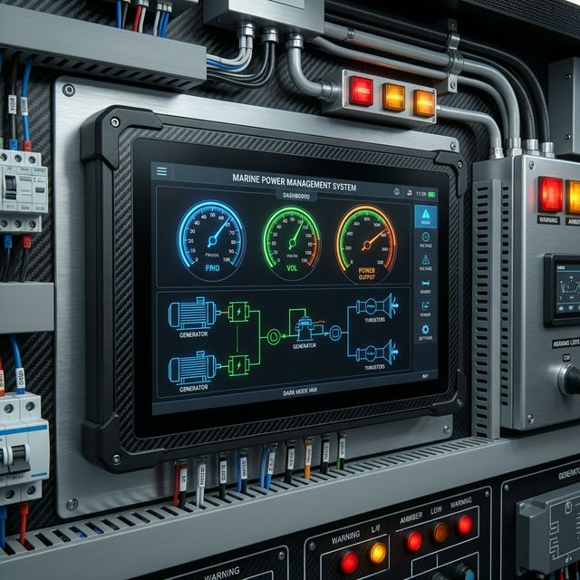
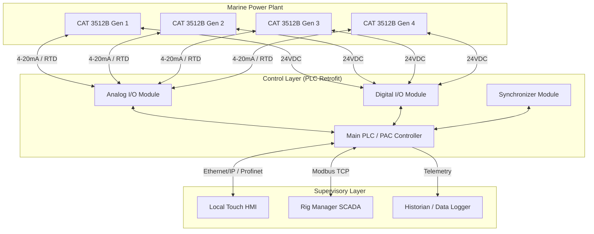
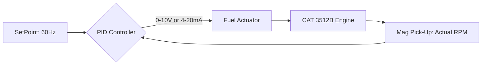
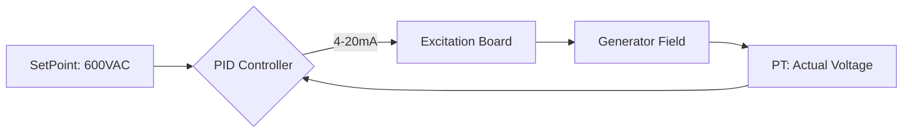

  
  
  <h1>🚢 Marine Power Management System (PMS) Architecture</h1>
  
<strong>Control System Retrofit Strategy: Legacy EG-III to Modern PLC Automation</strong>

  <a href="#-problem-statement">Problem Statement</a> •
  <a href="#-system-architecture">Architecture</a> •
  <a href="#-control-logic-pid">Control Logic</a> •
  <a href="#-io-matrix">I/O Matrix</a>

---

> [!CAUTION]
> **Confidentiality Notice:** This repository contains the **System Architecture and Design Strategy** for upgrading marine gen-set controllers. Due to industrial confidentiality, intellectual property, and safety regulations, the proprietary PLC ladder logic, exact HMI source code, and specific P&ID diagrams are kept private. This repository serves as a technical portfolio piece demonstrating systems engineering capability and architectural planning.

## 🚨 Problem Statement

Legacy offshore drilling rigs (such as the MODU Rig-42) rely on older analog control modules (e.g., Ross Hill EG-III) to manage electrical generation via Caterpillar 3500-series diesel generators.

As these systems age, they face critical challenges:
1. **Obsolescence:** Spare parts are scarce, and repairs must be outsourced internationally with long lead times.
2. **Lack of Telemetry:** Analog modules lack data logging, making root-cause analysis after a blackout nearly impossible.
3. **Blackout Risk:** A single component failure in an analog board can cascade, causing a total loss of power (blackout), pausing drilling operations, and incurring massive financial losses.

**The Solution:** A complete retrofit of the control architecture using Programmable Logic Controllers (PLCs), modern SCADA HMIs, and robust PID control loops to manage voltage (AVR) and frequency (Governor).

---

## 🏗 System Architecture

The new architecture decouples the physical generator from the logic controller, introducing a central, modular, and redundant PLC system.

---

## ⚙️ Control Logic (PID)

The core electrical generation variables are regulated using active PID control loops executed by the PLC, replacing the outdated analog operational amplifiers.

### 1. Active Power & Frequency Control (Governor)
The PLC monitors the grid frequency via a magnetic pickup sensor on the engine's flywheel and adjusts the fuel actuator to maintain a strict 60Hz.

### 2. Reactive Power & Voltage Control (AVR)
The PLC acts as the Automatic Voltage Regulator (AVR), adjusting the excitation current to maintain 600VAC on the main generator bus.

---

## 🚥 Input / Output (I/O) Integration Matrix

The success of the retrofit depends on correctly mapping the legacy analog signals to the new discrete and analog PLC modules.

| Signal Type | Description | Source / Destination | Range/Protocol |
| :--- | :--- | :--- | :--- |
| **Analog IN** | Engine RPM (Magnetic Pick-up) | Flywheel Sensor | Frequency (Hz) |
| **Analog IN** | Generator Output Voltage (PT) | Main Bus | 0-120VAC (Scaled) |
| **Analog IN** | Phase Angle (Synchroscope) | Sync Module | -180° to +180° |
| **Analog IN** | Temperatures & Pressures | Engine Sensors | 4-20mA / RTD |
| **Digital IN** | Emergency Stop (E-Stop) | Field Pushbutton | 24VDC (NC) |
| **Digital IN** | Breaker Status (Open/Closed) | Switchgear | 24VDC |
| **Analog OUT**| Fuel Actuator Command | Governor Linkage | 0-10VDC |
| **Analog OUT**| Excitation Command | Exciter Board | 4-20mA |
| **Digital OUT**| Breaker Close Command | Switchgear Coil | 24VDC Pulse |
| **Digital OUT**| Alarm Annunciator Horn/Beacon | Engine Room | 24VDC |

---

## 🛡️ Target Improvements & Impact

- **Response Time:** Fault diagnosis drops from weeks to minutes due to active SCADA alarming and historical trending.
- **Safety:** Hardwired and software-based trip conditions (Overspeed, Low Oil Pressure, High Vibration) prevent catastrophic engine failure.
- **Scalability:** The PLC architecture allows for future integration with shore-power concepts or hybrid battery systems (BESS).
